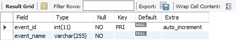
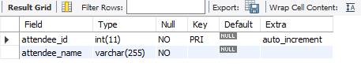
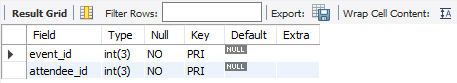
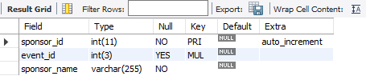
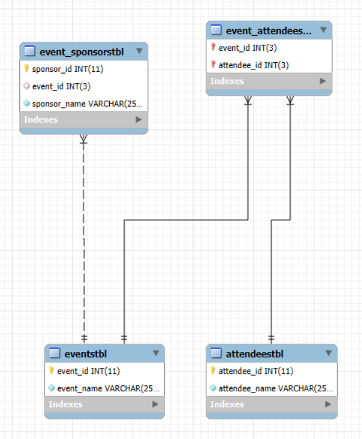

# Finals Lab Task 1 – MySQL Basics (Event Management)

## 💬 Overview
This task involves **designing and implementing** a relational database using **MySQL statements**. The database consists of four main tables: *Events, Attendees, Event Attendees, and Event Sponsors*. Each table demonstrates key relational database concepts, including **primary keys, foreign keys, composite keys, and relationships**.

---

## 📝 Step 1: Database Design
- **Events Table**: Stores event details with `event_id` and `event_name`.
- **Attendees Table**: Tracks attendees with `attendee_id` and `attendee_name`.
- **Event_Attendees Table**: Establishes a **many-to-many relationship** between events and attendees.
- **Event_Sponsors Table**: Links sponsors to events while storing sponsorship details.

---

## 🛠️ Step 2: SQL Implementation
- Created tables with appropriate **primary and foreign key constraints**.
- Ensured proper **relationship mapping** using composite keys.
- Exported the full **SQL structure** using **phpMyAdmin** or **MySQL Workbench**.

---

## Step 3: MySQL Query Statements (SQL Commands)

## Step 4: Table Structure Screenshots
### Events Table:

### Attendees Table:

### Event_Attendees Table:

### Event_Sponsors Table:

## Step 5: ER Diagram Representation

---

## 🔗 SQL Copy of the Database
**Download the complete SQL file here:** 📂 [Event Management](https://github.com/angelie2/EDM-Projects-Fajarito/blob/main/rawfile/Finals%20Lab%20Task%201%20Event%20Management.sql)

This documentation provides a structured and detailed guide for implementing a **MySQL database** for event management. 🚀
