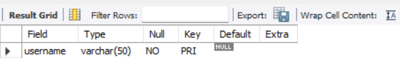
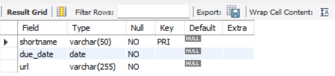
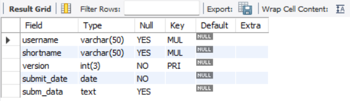
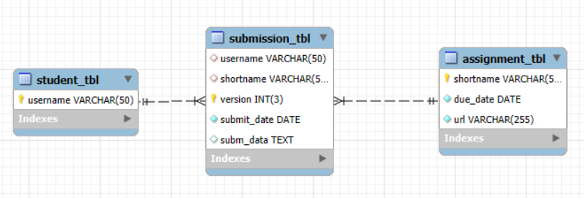

# Finals Task 2 – Transforming ER Model to Relational Tables

## ⏳ Overview
This task involves **developing and structuring** a relational database derived from an **ER model** that tracks student assignment submissions. Converted all entities and attributes into MySQL tables including *Student, Assignment, and Submission*. Established well-defined primary and foreign keys while ensuring accurate relationship modeling to maintain referential integrity.

---

## 👩‍🎓 Step 1: Designing the Students Table
- Establish a table to **store student records**.
- Ensure each student has a **unique identifier** (*username*) with a **maximum of 50 characters**.
- Set the username as the **primary key** to prevent duplicates.

---

## 📚 Step 2: Designing the Assignments Table
- Create a table to **store details of assignments**.
- Define a short name (*shortname*) as the **unique identifier** for each assignment.
- Include a `due date` field, ensuring it cannot be left empty.
- Add an optional `URL` field to store related links, allowing null values when no URL is provided.

---

## 📤 Step 3: Designing the Submissions Table
- Develop a table that **connects students to their assignments**.
- Ensure that submissions **link a student** (*username*) to an **assignment** (*shortname*).
- Allow version **tracking**, enabling multiple submissions per student per assignment.
- Include a `submission date` field to record the exact time of submission.
- Provide a `data field` to store the actual content of the submission.
- Maintain **referential integrity** by linking students and assignments through foreign keys.

---

# Outputs:
## MySQL Query Statements (SQL Commands)

## Table Structures Screenshot:
### Students Table:

### Assignment Table:

### Submission Table:

## ER Diagram Representation

---

## 🔗 SQL Copy of the Database
**Download the complete SQL file here:** [Transforming ER Model to Relational Tables](https://github.com/angelie2/EDM-Projects-Fajarito/blob/main/rawfile/Finals%20Lab%20Task%202%20Transforming%20ER%20Model%20to%20Relational%20Tables.sql)

This documentation provides a structured and detailed guide for implementing a **Transforming ER Model to Relational Tables**. 🚀

