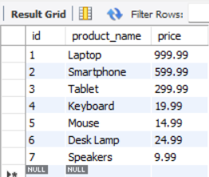
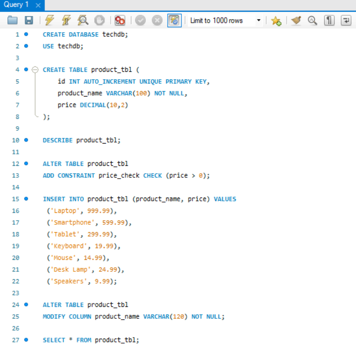
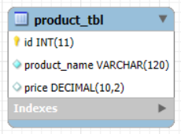

# Finals Lab Task 3 – Table Manipulation

## 📄 Overview
This task focuses on **designing and modifying** a MySQL table named products. The table was structured with appropriate data types and constraints, ensuring data integrity and enforceability of business rules. Key implementations include a `CHECK` constraint to validate pricing and alterations to the table structure.

---

## 🛠️ Step 1: Table Creation (products)
- **ID**: Unique integer, auto-increment, set as the primary key.
- **Product_Name**: String (VARCHAR) with a maximum length of 100 characters, cannot be null (NOT NULL).
- **Price**: Decimal, representing product pricing.

---

## 🚧 Step 2: Adding Constraints
- Implemented a `CHECK` constraint to ensure that price values remain greater than 0.

---

## 📝 Step 3: Product Data Insertion
Only valid entries were added to the table, ensuring no violations of the pricing constraint:
- Product 1: "Laptop" - 999.99
- Product 2: "Smartphone" - 599.99
- Product 3: "Tablet" - 299.99
- Product 4: "Keyboard" - 19.99
- Product 5: "Mouse" - 14.99
- Product 6: "Desk Lamp" - 24.99
- Product 7: "Speakers" - 9.99

⚠️ Invalid Entries (Not Inserted Due to `CHECK` Constraint)❗
- "Headphones" - (-49.99)
- "Monitor" - (-149.99)
- "External Hard Drive" - (-79.99)

---

## Step 4: Modifying Table Structure
Altered the `product_name` column to increase its maximum length to 120 characters using ALTER TABLE.

---

# Outputs:
## MySQL Query Statements (SQL Commands)

## Updated Table Structure
### Products Table

## ER Diagram Representation

---

## 🔗 SQL Copy of the Database
**Download the complete SQL file here:** 📂 [Table Manipulation](https://github.com/angelie2/EDM-Projects-Fajarito/blob/main/rawfile/Finals%20Lab%20Task%203%20Table%20Manipulation.sql)

This documentation provides a structured and detailed guide for implementing a **Table Manipulation**. 🚀

