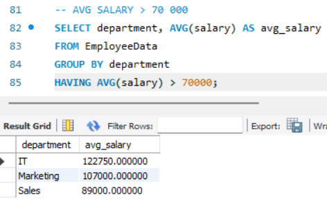
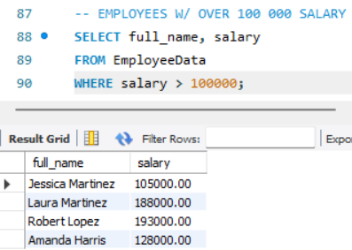
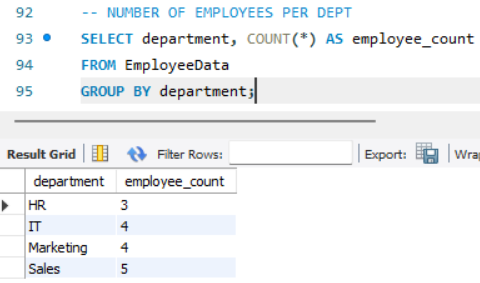

# Finals Lab Task 4: Implementing SELECT Queries

## 🎯 Overview:
This tasks focuses on a single database containing two tables: `EmployeeSalaries` and `EmployeeData`. The main goal was to execute various SELECT queries to **extract and manipulate** employee-related data efficiently.

---

## 📄 Steps to Complete the Task:  
1. Create a database named `payroll` and switch to it using the `USE payroll` statement.  
2. Copy and paste the provided initial query into the database.  
3. Perform the required SELECT queries for each of the problems outlined below.

## 🌟 **Problem 1:**
The `EmployeeSalaries` table contains salary information for employees with the following schema:  
- `employee_id INT AUTO_INCREMENT PRIMARY KEY`  
- `employee_name VARCHAR(100)`  
- `department VARCHAR(50)`  
- `salary DECIMAL(10,2)`  
- `hire_date DATE`  

Using this table, perform the following queries:  
1. Retrieve `employee_name` and `salary` from the table, sorted from highest salary to lowest.  
2. Retrieve the names of departments along with the average salary for each.  
3. Retrieve `department`, `salary`, and calculate the total salary for each department.

---

# Outputs:

## Retrieve the employee_name and salary of employees and arrange from the highest salary to the lowest.

## Retrieve the department names along with the average salary for each department.

## Retrieve Department, Salary and Calculate total salary for each DEPARTMENT

---

## ✨ **Problem 2:**  
The `EmployeeData` table stores information about employees with the following schema:  
- `employee_id INT AUTO_INCREMENT PRIMARY KEY`  
- `full_name VARCHAR(100)`  
- `department VARCHAR(50)`  
- `salary DECIMAL(10,2)`  
- `hire_date DATE`  
- `manager_id INT`  

Using this table, perform the following queries:  
1. Retrieve `full_name` and `salary` of employees, sorted from the highest salary to the lowest.  
2. Retrieve the average salary for all employees, filtered where the average salary exceeds $70,000.  
3. Retrieve the `full_name` of employees earning more than $100,000.  
4. Retrieve the total number of employees recorded in the table.

---

# Outputs:

## Retrieve the employees along with their full names and salaries from highest paying employee to the lowest.

## Retrieve the average salary from EmployeeData table, where the average salary exceeds $70,000.

## Retrieve the full names of employees who earn a salary greater than $100,000.

## Retrieve the number of employees from the EmployeeData table.

---

# 🔗 SQL Copy of the Database 
**Download the complete SQL file here:** 📂 [SELECT Queries](https://github.com/angelie2/EDM-Projects-Fajarito/blob/main/rawfile/Finals%20Lab%20Task%204%20Implementing%20SELECT%20Queries.sqll)

This documentation provides a structured and detailed guide for implementing a **SELECT Queries**. 🚀

