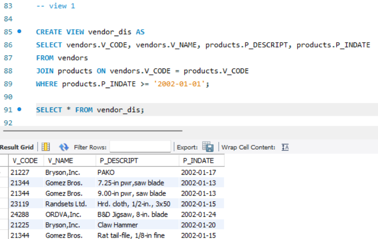
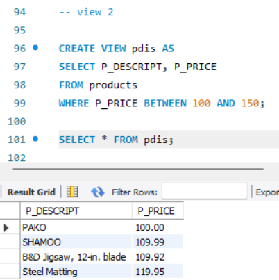
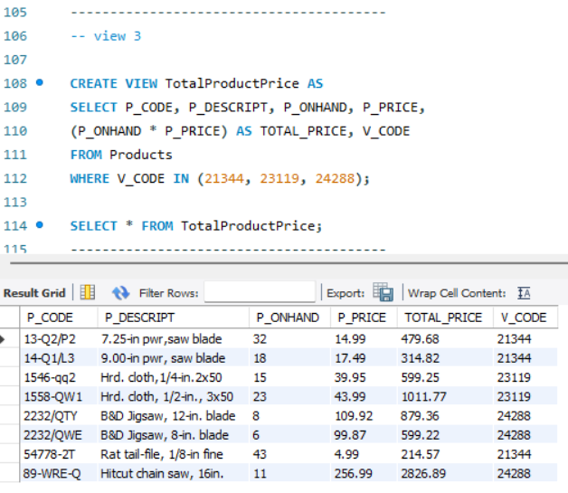
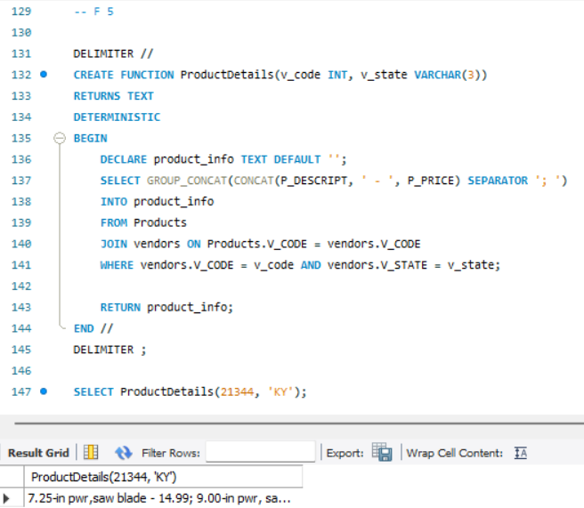

# Finals Lab Task 5 – Utilizing SQL Views, Stored Procedures, and Functions

## 🎯 Overview:
This task involves working with an inventory database containing two tables: `Products` and `Vendors`. The main goal is to implement **SQL Views, Stored Procedures, and Functions** to efficiently manage and retrieve relevant vendor and product data.

---

## 📄 Task Instructions:
## ✅ Setup:
1. **Understand SQL Views and Stored Procedures** by reviewing lecture materials.
2. Start **XAMPP** and **MySQL Workbench**, then establish a connection.
3. Open `democodes.sql` and execute sample queries using hrd.sql.
4. Once familiar with practice examples, proceed with inventory.sql.
5. **Execute the required SQL queries** and take screenshots of the output.

---

## 🌟 **SQL Queries & Required Operations:**
## Create SQL Views:
1️⃣ **View 1**: Display vendor code, vendor name, product description, and product entry date for all products with an p_indate from 2002 onwards. 

2️⃣ **View 2**: Retrieve all products with a price range between $100 and $150. 

3️⃣ **View 3**: Compute TOTAL_PRICE for all products by multiplying P_ONHAND × P_PRICE, limited to vendors with v_code 21344, 23119, and 24288.

## Create a Stored Procedure:
📌 Implement a stored procedure that updates the vendor name from ‘Bryson, Inc.’ to ‘Bryson and Co’, using a single parameter.
## Create a SQL Function:
📌 Develop a function that accepts two parameters (v_code and v_state) and retrieves product descriptions and prices based on these values.

---
## 📊 Outputs:
## View 1: Retrieve Vendor Details from 2002 Onwards

## View 2: Display Products in Price Range $100–$150

## View 3: Compute Total Product Price for Specific Vendors

## Stored Procedure: Updating Vendor Name

## Function: Retrieve Product Description and Price Based on Vendor Parameters

---

## 🔗 SQL Copy of the Database
Download the complete SQL dataset here: 📂 [SQL Views & Stored Procedures]()

This documentation provides a detailed and structured guide for implementing SQL Views, Stored Procedures, and Functions effectively. 🚀
