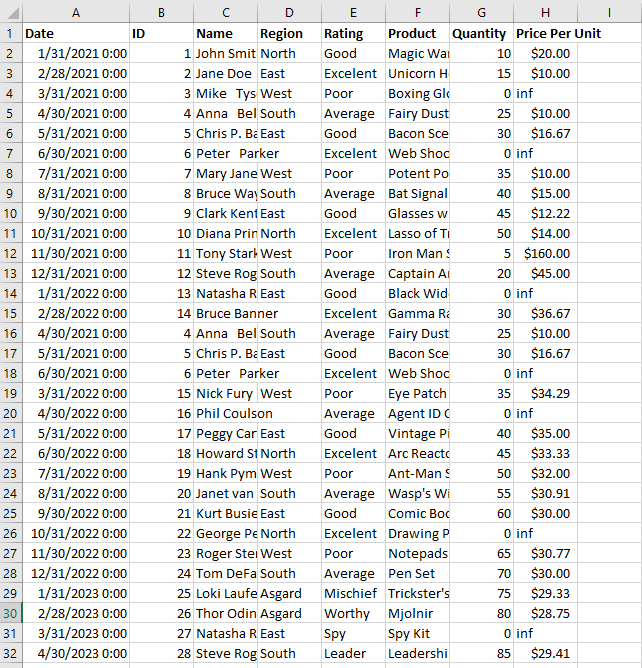
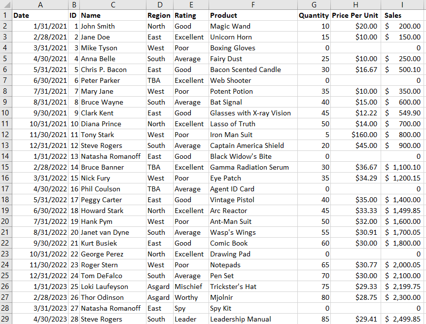
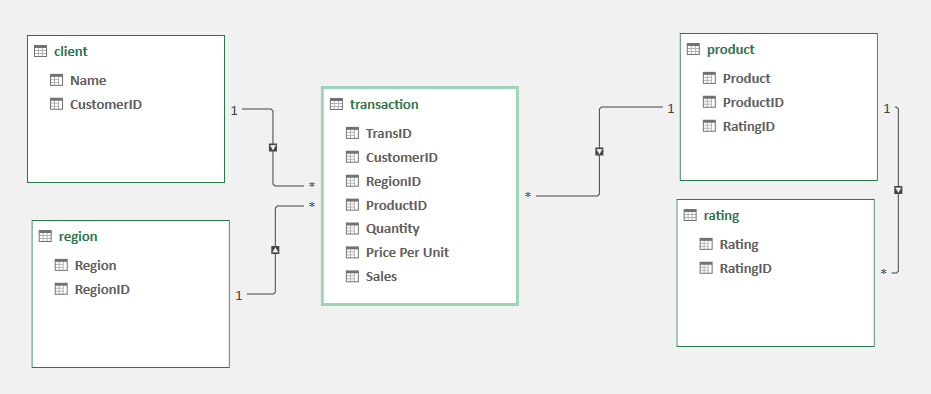

# Midterm Lab Task 1 – Data Cleaning and Normalization in Excel

## Overview
In this task, we process raw flat data from Excel by performing data cleaning, normalization, and mapping it into a Physical Data Model.

## Step 1: Data Cleaning
- Load the raw Excel file.
- Adjust column and row dimensions for better readability.
- Remove excess spaces using the TRIM function.
- Eliminate NULL values to ensure data integrity.
- Identify and remove duplicate entries.

## Step 2: Data Normalization
- Apply **First Normal Form (1NF)** to structure the data properly.
- Decompose tables using **Second Normal Form (2NF)** for improved organization.
- Further refine the structure following **Third Normal Form (3NF)** principles.
- Map the transformed tables into a **Physical Data Model** for efficient database design.

## Step 3: Initial Raw Data Screenshot

## Step 4: Cleaned Data Screenshot

## Step 5: Final Physical Data Model

This documentation outlines the structured approach to cleaning and preparing data efficiently in Excel. 🚀
