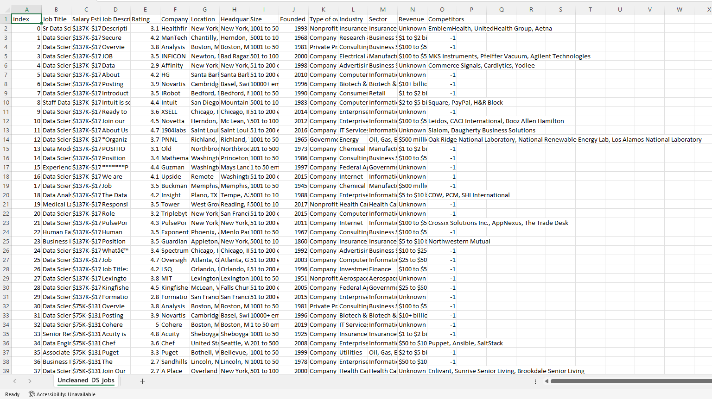
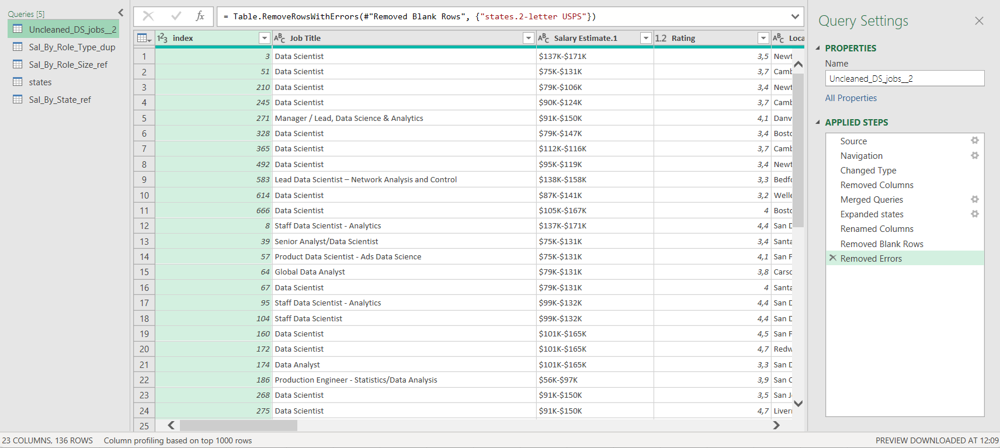

# Midterm Lab Task 2 – Data Cleaning and Transformation using Power Query Editor

## 🔍 Overview
This task focuses on cleaning and transforming the **Uncleaned_DS_Jobs.csv** dataset from Kaggle using Excel's Power Query Editor. The objective is to generate meaningful insights by analyzing salary trends across various job roles, company sizes, and locations.

---

## 📄 Key Questions Addressed:
- Which job roles offer the highest and lowest salaries?
- What company sizes provide the best salary opportunities?
- How do salary trends vary by job title across different states?

---

## 💡 Step 1: Initial Dataset Before Cleaning and Transformation

---

## ✨ Step 2: Data Cleaning Process
- **Preserved the raw dataset** by duplicating it.
- **Cleaned salary data** by removing extraneous symbols and extracting minimum and maximum salary values.
- **Created a new column** to classify job roles into categories such as *Data Scientist, Data Analyst, Data Engineer, Machine Learning Engineer, or Other*.
- **Standardized location data** by correcting state entries, splitting city and state abbreviations, and replacing incorrect values.
- **Refined company size data** by extracting minimum and maximum employee count while removing unnecessary text.
- **Addressed invalid or missing values**:
  - Competitors: Replaced `-1` with `"N/A"`.
  - Revenue: Converted negative values to `0`.
  - Industry: Substituted `-1` with `"Other"`.
- **Cleaned company names** by removing extra ratings or appended numbers.
- **Dropped irrelevant columns** such as job descriptions.

---

## 🧩 Step 3: Data Reshaping and Transformation
- **Created a reference for salary by role type**, grouped by job category, and converted salaries to currency format.
- **Generated salary insights by company size**, aggregating values to identify trends.
- **Merged a state mapping file** to standardize state abbreviations with full names.
- **Computed salary trends by state**, grouping results to present an overview of pay variations across locations.
- **Validated query dependencies** to ensure accuracy in data relationships.

---

## 🛠️ Step 4: Final Output Screenshots
### Cleaned Dataset:

### Salary by Role Type:

### Salary by Company Size:

### Salary by State:

### Query Dependencies:

---

## 🔗 Final Excel Output:
**Download the complete Excel file here:** [Data Cleaning and Transformation using Power Query Editor](https://github.com/angelie2/EDM-Projects-Fajarito/tree/main/rawfile)

This documentation outlines a systematic approach to **cleaning and transformation of data** using Power Query for deeper analysis. 🚀
